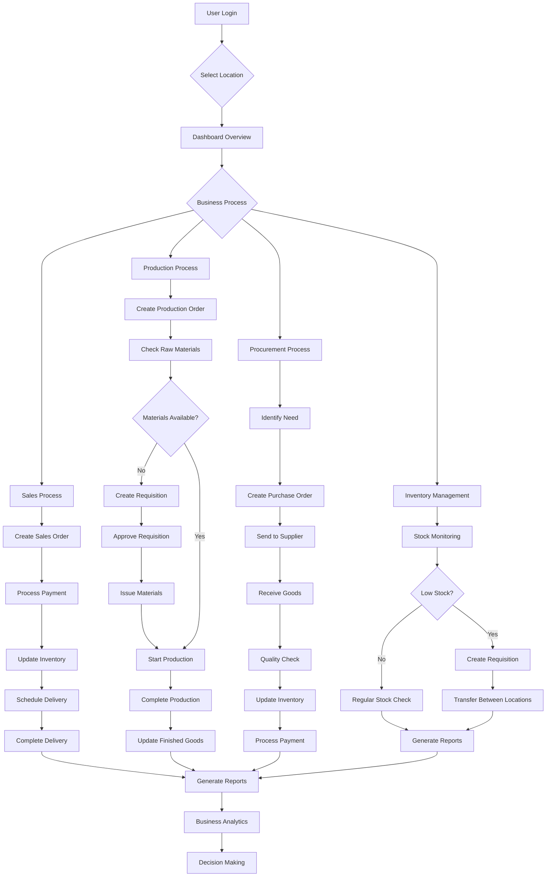

# ERP System Demo Business Flow

## Overview

This document outlines the complete business flow for the Central Kitchen ERP System (Dapoer Roema) from start to end, designed for demonstration purposes. The system manages inventory, production, procurement, and sales operations across multiple locations.

## Business Flow Chart

## Detailed Business Processes

### 1. User Authentication & Setup

**Entry Point**: User Login

- User authenticates with email/password
- System validates credentials and permissions
- User selects active work location
- Dashboard loads with relevant data and quick actions

**Key Screens**:

- `/auth` - Login page
- `/welcome` - Welcome screen with quick actions
- `/dashboard` - Main dashboard with statistics

### 2. Sales Process Flow

**Purpose**: Manage customer orders from creation to delivery

**Steps**:

1. **Order Creation** (`/sales-orders/new`)

   - Customer information entry
   - Product selection from catalog
   - Quantity and pricing confirmation
   - Payment method selection

2. **Order Processing**

   - Payment verification
   - Inventory allocation
   - Order confirmation

3. **Fulfillment** (`/deliveries`)

   - Order preparation
   - Delivery scheduling
   - Tracking and status updates

4. **Completion**
   - Delivery confirmation
   - Customer satisfaction
   - Revenue recognition

### 3. Production Process Flow

**Purpose**: Transform raw materials into finished products

**Steps**:

1. **Production Planning** (`/production-orders/new`)

   - Recipe selection
   - Quantity planning
   - Timeline scheduling

2. **Material Requirements**

   - Raw material calculation
   - Inventory availability check
   - Requisition creation if needed

3. **Material Requisition** (`/requisitions/new`)

   - Request materials from warehouse
   - Manager approval workflow
   - Material issuance and tracking

4. **Production Execution**

   - Work order execution
   - Quality control checkpoints
   - WIP tracking

5. **Completion**
   - Finished goods receipt
   - Inventory update
   - Production reporting

### 4. Procurement Process Flow

**Purpose**: Acquire raw materials and supplies from vendors

**Steps**:

1. **Need Identification**

   - Low stock alerts
   - Production requirements
   - Seasonal planning

2. **Purchase Order Creation** (`/purchase-orders/new`)

   - Supplier selection
   - Item specification
   - Price negotiation
   - Terms and conditions

3. **Order Management**

   - PO approval workflow
   - Supplier communication
   - Order tracking

4. **Goods Receipt** (`/goods-receipts/new`)

   - Delivery verification
   - Quality inspection
   - Quantity confirmation
   - Damage assessment

5. **Processing**
   - Invoice verification
   - Payment processing
   - Inventory update
   - Supplier performance tracking

### 5. Inventory Management Flow

**Purpose**: Maintain optimal stock levels across locations

**Steps**:

1. **Stock Monitoring** (`/inventory`)

   - Real-time stock levels
   - Location-wise tracking
   - FEFO (First Expired, First Out) management

2. **Stock Transfers** (`/stock-transfers/new`)

   - Inter-location transfers
   - Requisition-based transfers
   - Transfer tracking

3. **Stock Adjustments** (`/stock-adjustments/new`)

   - Waste recording
   - Loss adjustment
   - Physical count corrections

4. **Quality Control** (`/temperature-logs`)
   - Temperature monitoring
   - Quality checkpoints
   - Compliance tracking

### 6. Master Data Management

**Purpose**: Maintain core business data

**Key Modules**:

- **Products** (`/products`) - Product catalog, variants, pricing
- **Categories** (`/categories`) - Product categorization
- **Suppliers** (`/suppliers`) - Vendor management
- **Locations** (`/locations`) - Site management
- **Users** (`/users`) - User administration
- **Roles** (`/roles`) - Permission management

### 7. Reporting & Analytics

**Purpose**: Business intelligence and decision support

**Key Reports**:

- **Sales Reports** (`/reports/daily-sales`)
- **Inventory Reports**
- **Production Reports**
- **Procurement Analytics**
- **Financial Summaries**

## Demo Scenarios

### Scenario 1: Daily Operations

1. **Morning Setup**

   - Login and select location
   - Review dashboard for pending tasks
   - Check inventory levels

2. **Sales Activities**

   - Process customer orders
   - Handle payments
   - Schedule deliveries

3. **Production Activities**

   - Review production schedule
   - Create new production orders
   - Monitor material requirements

4. **Closing Activities**
   - Generate daily reports
   - Review inventory movements
   - Plan next day's activities

### Scenario 2: Stock Requisition Process

1. **Identify Need**

   - Production planner identifies material shortage
   - Creates requisition request

2. **Approval Workflow**

   - Manager reviews and approves requisition
   - System automatically creates stock transfer

3. **Material Issuance**
   - Warehouse processes transfer
   - Materials moved to production area
   - Production can begin

### Scenario 3: Multi-Location Operations

1. **Central Kitchen Operations**

   - Raw material procurement
   - Food production
   - Quality control

2. **Outlet Operations**

   - Stock requisition from central kitchen
   - Sales to customers
   - Inventory management

3. **Coordination**
   - Inter-location transfers
   - Centralized reporting
   - Resource optimization

## Key Features Demonstrated

### 1. Role-Based Access Control

- Different user roles (Admin, Manager, Cashier, Staff)
- Location-specific access
- Module-based permissions

### 2. Multi-Tenant Architecture

- Separate business entities
- Data isolation
- Customizable settings

### 3. Real-Time Tracking

- Live inventory updates
- Order status tracking
- Production monitoring

### 4. Integration Points

- Supplier systems
- Payment gateways
- Delivery tracking

### 5. Compliance & Quality

- Temperature monitoring
- Quality checkpoints
- Audit trails

## Technical Implementation Notes

### Frontend Architecture

- Next.js 14 with App Router
- TypeScript for type safety
- Tailwind CSS for styling
- Responsive design (7xl width standardization)

### Backend Architecture

- RESTful API design
- Modular service structure
- Database-driven permissions
- Real-time updates

### Security Features

- JWT-based authentication
- Role-based authorization
- Data encryption
- Audit logging

## Demo Checklist

### Pre-Demo Setup

- [ ] Create demo tenant
- [ ] Set up multiple locations
- [ ] Create user accounts with different roles
- [ ] Populate master data (products, suppliers, etc.)
- [ ] Configure initial inventory levels

### Demo Flow Execution

- [ ] User login and location selection
- [ ] Dashboard overview and quick actions
- [ ] Sales order creation and processing
- [ ] Production order creation
- [ ] Material requisition process
- [ ] Stock transfer between locations
- [ ] Purchase order creation
- [ ] Goods receipt processing
- [ ] Report generation and analysis
- [ ] User and role management

### Post-Demo Review

- [ ] System performance evaluation
- [ ] User feedback collection
- [ ] Feature gap identification
- [ ] Improvement recommendations

## Success Metrics

### Business Metrics

- Order processing time reduction
- Inventory accuracy improvement
- Production efficiency gains
- Cost reduction through optimization

### System Metrics

- User adoption rate
- Transaction processing speed
- System uptime and reliability
- Data accuracy and integrity

## Future Enhancements

### Phase 2 Features

- Mobile app for field operations
- Advanced analytics and AI insights
- Integration with accounting systems
- Supply chain optimization tools

### Phase 3 Features

- Customer portal
- Supplier portal integration
- Advanced forecasting
- Automated procurement suggestions

---

This demo flow provides a comprehensive overview of the ERP system's capabilities, demonstrating how different business processes integrate seamlessly to provide end-to-end visibility and control over operations.
