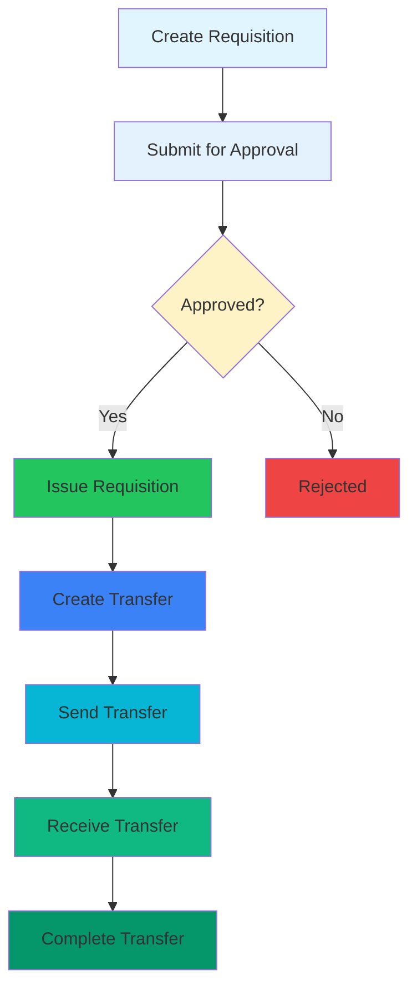

# Requisition-Transfer Integration

This document describes the integration between Requisitions and Transfers modules in the ERP system.

## Overview

The integration creates a seamless workflow from requesting inventory to actually moving it between locations. Previously, these modules operated independently, requiring manual coordination between requisition approval and transfer creation.

## Key Features Implemented

### 1. Database Integration

- **New Fields Added to Requisitions Table:**

  - `transfer_id`: Links to the transfer created from this requisition
  - `issue_status`: Tracks fulfillment status (pending/partial/fully_issued)
  - `issued_date`: Records when items were issued

- **Database Migration:**
  - Migration file: `apps/erp-api/drizzle/0003_requisition_transfer_integration.sql`
  - Adds proper foreign key relationship between requisitions and transfers
  - Includes performance indexes for efficient querying

### 2. API Integration

- **New Endpoint:** `POST /api/v1/requisitions/:id/issue`
  - Converts approved requisitions into transfers
  - Updates requisition with transfer reference
  - Returns both requisition and created transfer details

### 3. Frontend Integration

- **Requisition Detail Page:** `apps/erp/app/(app)/requisitions/[id]/page.tsx`

  - Shows transfer status and link to generated transfer
  - "Issue Requisition" button for approved requisitions
  - Complete requisition details with issue tracking

- **Requisition List Page:** `apps/erp/app/(app)/requisitions/client.tsx`
  - Added issue status column
  - Transfer link column for issued requisitions
  - Enhanced status indicators

### 4. Dashboard Integration

- **Dashboard Page:** `apps/erp/app/(app)/dashboard/page.tsx`

  - Pending requisitions widget
  - In-transit transfers widget
  - Quick action buttons
  - Recent activity feeds

- **Dashboard API:** `apps/erp-api/src/routes/v1/dashboard.routes.ts`
  - Statistics endpoint for dashboard widgets
  - Counts pending/approved requisitions
  - Tracks in-transit and completed transfers

## Workflow



## Usage Instructions

### For Users:

1. **Create Requisition:** Use the Requisitions menu to request inventory
2. **Wait for Approval:** System notifies when requisition is approved
3. **Issue Requisition:** Click "Issue Requisition" button on approved requisition
4. **Track Transfer:** System automatically creates and links to transfer
5. **Monitor Progress:** Use dashboard to track pending and in-transit items

### For Administrators:

1. **Approve Requisitions:** Review and approve pending requisitions
2. **Monitor Dashboard:** Track workflow efficiency and bottlenecks
3. **Manage Transfers:** oversee transfer execution and completion

## Benefits

1. **Streamlined Workflow:** Eliminates manual transfer creation
2. **Better Visibility:** Clear status tracking from request to delivery
3. **Reduced Errors:** Automatic data transfer reduces manual entry errors
4. **Audit Trail:** Complete history from requisition to transfer completion
5. **Performance Insights:** Dashboard metrics for process optimization

## Technical Details

### Database Schema Changes:

```sql
-- Added to requisitions table
ALTER TABLE "erp"."requisitions"
ADD COLUMN "transfer_id" uuid REFERENCES "erp"."transfers"("id") ON DELETE SET NULL,
ADD COLUMN "issue_status" varchar(24) NOT NULL DEFAULT 'pending';

-- Added indexes
CREATE INDEX "idx_req_transfer" ON "erp"."requisitions"("transfer_id");
CREATE INDEX "idx_req_issue_status" ON "erp"."requisitions"("issue_status");
```

### API Response Format:

```json
{
  "success": true,
  "message": "Requisition issued successfully",
  "data": {
    "requisition": {
      /* Requisition details */
    },
    "transfer": {
      /* Created transfer details */
    }
  }
}
```

## Future Enhancements

The following features are planned for future releases:

1. **Bulk Operations:** Issue multiple requisitions at once
2. **Inventory Reservations:** Hold stock for approved requisitions
3. **Notifications:** Email/alert system for status changes
4. **Reporting:** Cycle time and fulfillment analytics
5. **Partial Fulfillment:** Support for partial requisition fulfillment
6. **Multi-level Approvals:** Configurable approval workflows
7. **Audit Trail:** Complete modification history
8. **Production Integration:** Auto-requisitions from production orders
9. **Automated Transfers:** Threshold-based transfer creation

## Files Modified

### Backend:

- `apps/erp-api/src/config/schema.ts` - Database schema updates
- `apps/erp-api/src/modules/requisitions/requisition.schema.ts` - Type definitions
- `apps/erp-api/src/modules/requisitions/requisition.service.ts` - Issue functionality
- `apps/erp-api/src/routes/v1/requisitions.routes.ts` - Issue endpoint
- `apps/erp-api/src/routes/v1/dashboard.routes.ts` - Dashboard API
- `apps/erp-api/src/routes/v1/index.ts` - Route registration
- `apps/erp-api/drizzle/0003_requisition_transfer_integration.sql` - Migration

### Frontend:

- `apps/erp/app/(app)/requisitions/[id]/page.tsx` - Detail page
- `apps/erp/app/(app)/requisitions/client.tsx` - List page
- `apps/erp/app/(app)/dashboard/page.tsx` - Dashboard
- `apps/erp/app/(app)/layout.tsx` - Navigation menu

## Testing

To test the integration:

1. **Database Migration:**

   ```bash
   psql -d your_database < apps/erp-api/drizzle/0003_requisition_transfer_integration.sql
   ```

2. **API Testing:**

   ```bash
   # Create a requisition
   curl -X POST http://localhost:3000/api/v1/requisitions \
     -H "Content-Type: application/json" \
     -d '{"fromLocationId": "...", "toLocationId": "...", "items": [...]}'

   # Approve the requisition
   curl -X POST http://localhost:3000/api/v1/requisitions/{id}/approve

   # Issue the requisition (creates transfer)
   curl -X POST http://localhost:3000/api/v1/requisitions/{id}/issue
   ```

3. **Frontend Testing:**
   - Navigate to `/requisitions`
   - Create a new requisition
   - Approve it through the system
   - Issue it and verify transfer creation
   - Check dashboard for updated statistics

## Support

For issues or questions about this integration:

1. Check the application logs for error details
2. Review the database migration status
3. Test with sample data in development environment
4. Contact the development team for complex issues

---

**Version:** 1.0.0  
**Last Updated:** 2025-11-29  
**Compatibility:** ERP v2.0+
